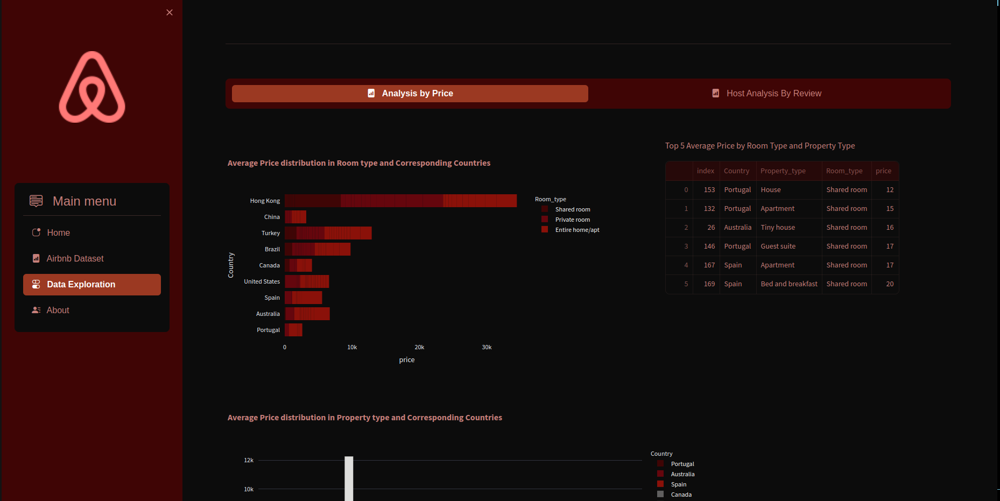

# **Airbnb Data Analysis Project**


## **Overview**
This project analyzes Airbnb data using **MongoDB Atlas** and develops an interactive **Streamlit web application** for visualizing insights into pricing variations, availability patterns, and location-based trends. The project also involves building a comprehensive dashboard using **Tableau** or **Power BI**.

## **Project Objectives**
1. **Data Cleaning & Preparation**: Clean and prepare the Airbnb dataset by handling missing values, removing duplicates, and performing data type conversions.
2. **Geospatial Visualization**: Develop an interactive web app showcasing Airbnb listings across various locations with pricing, ratings, and availability data.
3. **Price & Availability Analysis**: Analyze price variations by property type, location, and seasons, along with occupancy patterns and demand fluctuations.
4. **Dashboard Creation**: Build a detailed and interactive dashboard in **Tableau** or **Power BI** to present key insights from the dataset.

## **Tech Stack**
- **Programming Language**: Python
- **Database**: MongoDB Atlas
- **Web Application**: Streamlit
- **Visualization Libraries**:  Matplotlib, Seaborn, Plotly
- **Data Visualization Tools**: Tableau, Power BI

## **Dataset**
The project uses sample Airbnb data, which includes the following key attributes:
- `Listing ID`, `Listing Name`, `Description`
- `Host ID`, `Host Name`, `Neighbourhood`
- `Location (Longitude, Latitude)`
- `Price`, `Availability (Start/End Date)`
- `Amenities`, `Ratings`, `Reviews`

## **Setup Instructions**
### 1. **MongoDB Atlas Setup**
- Create a MongoDB Atlas account and set up a cluster.
- Load the Airbnb sample dataset into the cluster for analysis.

### 2. **Clone the Repository**
```bash
git clone https://github.com/Saravana-kr22/Airbnb_Analysis.git
cd Airbnb_Analysis
docker compose-up
```

### 3. **Tableau/Power BI Dashboard**
- Open the Tableau/Power BI file included in the repository.
- The dashboard is pre-built to visualize Airbnb insights including price variations, availability trends, and location-based analysis.
  
## **Key Features**

1. **MongoDB Integration**: Efficient data retrieval using MongoDB Atlas for performing data analysis.
2. **Data Cleaning**: Thorough cleaning process to ensure accuracy and consistency.
3. **Interactive Visualizations**: Dynamic maps showcasing Airbnb listings, prices, ratings, and availability.
4. **Geospatial Insights**: Analysis of location-based trends using geospatial data.
5. **Price & Availability Analysis**: Visualization of price patterns and seasonal availability.
6. **Comprehensive Dashboard**: A rich, interactive dashboard built using Tableau/Power BI for presenting insights.

<div style="display: flex;margin-bottom: 20px;">
    
    
</div>

## **Project Structure**

``` bash
|-- app.py                     # Streamlit web app script
|-- img/                       # images used in the project
|-- analysis/                  # Jupyter notebooks for data analysis
|-- Airbnb.csv                 # Cleaned dataset file
|-- dashboard/                 # Tableau/Power BI files for the dashboard
|-- requirements.txt           # Python dependencies
|-- README.md                  # Project overview
```

## CONTRIBUTING

Contributions to this project are welcome! If you encounter any issues or have suggestions for improvements, please feel free to submit a issue or pull request.

## LICENSE

This project is uses the Community Data License Agreement - Permissive - Version 2.0 licence from the Phope Pulse repository and licensed under the MIT License. Please review the LICENSE file for more details.

## CONTACT

📧 Email: smartsaravana002@gmail.com 

 LinkedIN : www.linkedin.com/in/saravana-perumal-k-07233b1b4


For any further questions or inquiries, feel free to reach out. 